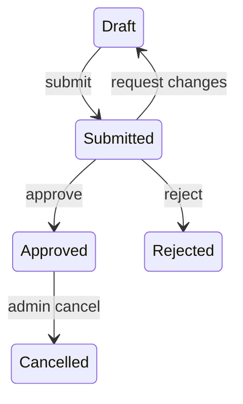

# State Model Reference

Use this reference to clarify lifecycle behavior before implementation.

A state model is needed when the work involves:

- Lifecycle states or status fields
- Workflows or approvals
- Payments, refunds, subscriptions, fulfilment, publishing, review, sync
- Async jobs, queues, retries, scheduled work
- Event-driven behavior
- Duplicate, late, out-of-order, or concurrent events
- Bugs caused by an action being legal in one state and illegal in another

## Minimum model

Write down the smallest useful model for the current phase.

### States

Every named state the system can be in.

For each state, define what it means in domain language.

### Events / commands

Every thing that can attempt to change state.

Use domain verbs where possible.

### Legal transitions

For each event, write the legal transitions:

```text
<Current state> + <Event> -> <Next state>
```

### Invalid transitions

For each event, define what happens when it is attempted from the wrong state:

- Reject with error
- Ignore
- Treat as idempotent no-op
- Queue for later
- Compensate / roll back
- Escalate to human

Do not leave invalid transitions implicit.

### Invariants

Facts that must remain true in every state.

Examples:

- A paid order always has a payment id.
- A cancelled job never emits completion events.
- A published article has immutable slug history.

### Terminal states

States that cannot transition further.

If a terminal state can still receive duplicate or late events, define the
idempotency behavior.

### Side effects

List side effects per transition, not per state:

- Persisted changes
- Emitted events
- External API calls
- Notifications
- Scheduled jobs
- Queue messages
- Audit log entries

### Race / replay behavior

Clarify:

- What if the same event arrives twice?
- What if events arrive out of order?
- What if two valid events arrive concurrently?
- What if a side effect succeeds but persistence fails?
- What if persistence succeeds but a side effect fails?

## Useful formats

Use whichever format is clearest.

### Transition table

| Current state | Event | Next state | Side effects | Invalid? |
|---|---|---|---|---|
| Draft | Submit | Submitted | Notify reviewers | No |
| Submitted | Approve | Approved | Publish approval event | No |
| Approved | Submit | Approved | None | Idempotent no-op |
| Cancelled | Approve | Cancelled | None | Reject |

### Mermaid state diagram

Use when relationships are easier to see visually.



### Test matrix

Use when preparing TDD.

| Behavior | Seam | Expected result |
|---|---|---|
| Submit draft | Public workflow interface | Draft becomes Submitted |
| Approve submitted item | Public workflow interface | Submitted becomes Approved |
| Approve approved item again | Public workflow interface | Idempotent no-op |
| Approve rejected item | Public workflow interface | Rejected with domain error |

## Completion criterion

The state model is clear enough when:

- Every named state has a domain meaning.
- Every event has legal transitions or is explicitly invalid.
- Invalid transitions are not implicit.
- Terminal states are identified.
- Invariants are stated.
- Side effects are attached to transitions.
- Duplicate, late, out-of-order, or concurrent events are handled or ruled out.
- The test seam is agreed before implementation.

If these cannot be answered from conversation, code, PRD, issue, or ADRs, ask
the user one question at a time using the `/grilling` discipline.

If the model still feels hard to reason about, use the `/prototype` logic branch.
