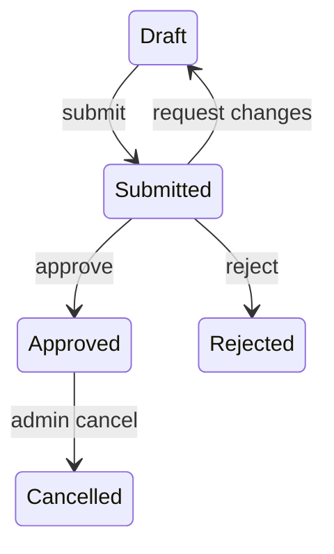

# State Model Reference

Use this reference after `/state-modeling` has named the state-bearing subject
and public seam.

## Minimum model

Write the smallest useful statechart for the current phase. A model can be a
short note, transition table, Mermaid diagram, or test matrix.

### Subject and seam

- **Subject**: the domain object or process whose state changes.
- **State sources**: persisted status fields, in-memory state, queue messages,
  external provider state, scheduled jobs, or event logs.
- **Public seam**: the command, handler, API, job processor, reducer, or service
  boundary where behavior will be tested or observed.

### States

List every named state in scope. For each state, define:

- What it means in domain language
- Where it is stored or derived
- Whether it is terminal

### Events / commands

List everything that can attempt to change state. Use domain verbs where
possible.

Distinguish:

- **Command**: intent from an actor, such as `submit`, `cancel`, or `retry`.
- **Event**: a fact that already happened, such as `payment_succeeded` or
  `provider_callback_received`.

### Legal transitions

For each event, write the legal transitions.

```text
<Current state> + <Event> -> <Next state>
```

If many states share the same behavior, group them explicitly.

### Invalid transitions

For each event, define what happens when it is attempted from the wrong state:

- Reject with error
- Ignore
- Treat as idempotent no-op
- Queue for later
- Compensate / roll back
- Escalate to human

Make invalid transitions explicit. When a full matrix would be noisy, group
states with the same invalid behavior and name the group.

### Invariants

List facts that must remain true in every state, and where each invariant is
enforced or tested.

Examples:

- A paid order always has a payment id.
- A cancelled job never emits completion events.
- A published article has immutable slug history.

### Terminal states

List states that cannot transition further. If a terminal state can still
receive duplicate or late events, define the idempotency behavior.

### Side effects

Attach side effects to transitions, not states:

- Persisted changes
- Emitted events
- External API calls
- Notifications
- Scheduled jobs
- Queue messages
- Audit log entries

For external side effects, state whether they happen before or after
persistence, and what happens if either side fails.

### Race / replay behavior

Clarify:

- What if the same event arrives twice?
- What if events arrive out of order?
- What if two valid events arrive concurrently?
- What if a side effect succeeds but persistence fails?
- What if persistence succeeds but a side effect fails?

When relevant, name the idempotency key, ordering source, lock/compare-and-swap
guard, retry policy, or compensation path.

## Useful formats

Use whichever format is clearest.

### State capsule

Use for small changes where a table would be more ceremony than clarity.

```text
Subject:
Seam:
States:
Events:
Invariants:
Terminal states:
Race/replay:
Test matrix:
```

### Transition table

| Current state | Event | Next state | Side effects | Invalid? |
|---|---|---|---|---|
| Draft | Submit | Submitted | Notify reviewers | No |
| Submitted | Approve | Approved | Publish approval event | No |
| Approved | Submit | Approved | None | Idempotent no-op |
| Cancelled | Approve | Cancelled | None | Reject |

### Mermaid state diagram

Use when relationships are easier to see visually.



### Test matrix

Use when preparing TDD.

| Behavior | Seam | Expected result |
|---|---|---|
| Submit draft | Public workflow interface | Draft becomes Submitted |
| Approve submitted item | Public workflow interface | Submitted becomes Approved |
| Approve approved item again | Public workflow interface | Idempotent no-op |
| Approve rejected item | Public workflow interface | Rejected with domain error |

## Completion criterion

The state model is clear enough when:

- The subject, state sources, and public seam are named.
- Every named state has a domain meaning.
- Every in-scope event has legal transitions or is explicitly invalid from each
  relevant state.
- Invalid transitions are explicit, even when grouped.
- Terminal states are identified.
- Invariants are stated with an enforcement or test point.
- Side effects are attached to transitions, with persistence ordering when
  external effects are involved.
- Duplicate, late, out-of-order, or concurrent events are handled or ruled out.
- The test matrix covers at least one legal transition, one invalid transition,
  and the terminal/idempotency behavior when terminal states or replay can
  occur.

If these cannot be answered from conversation, code, PRD, issue, or ADRs, ask
the user one question at a time using the `/grilling` discipline.

If the model still feels hard to reason about, use the `/prototype` logic branch.
